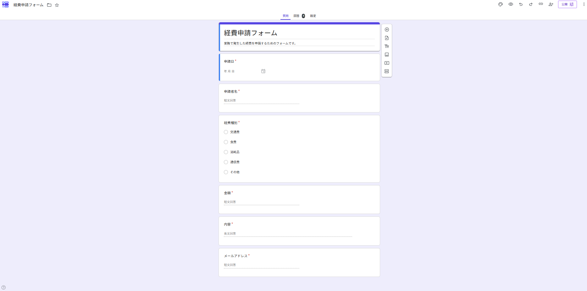
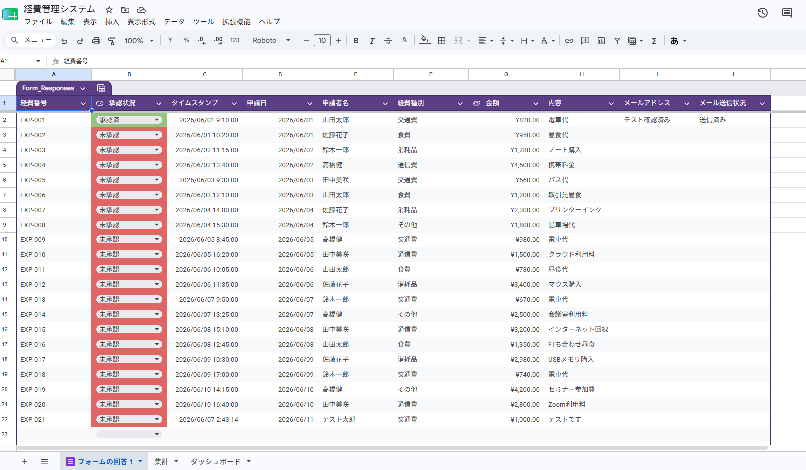
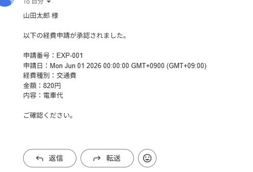
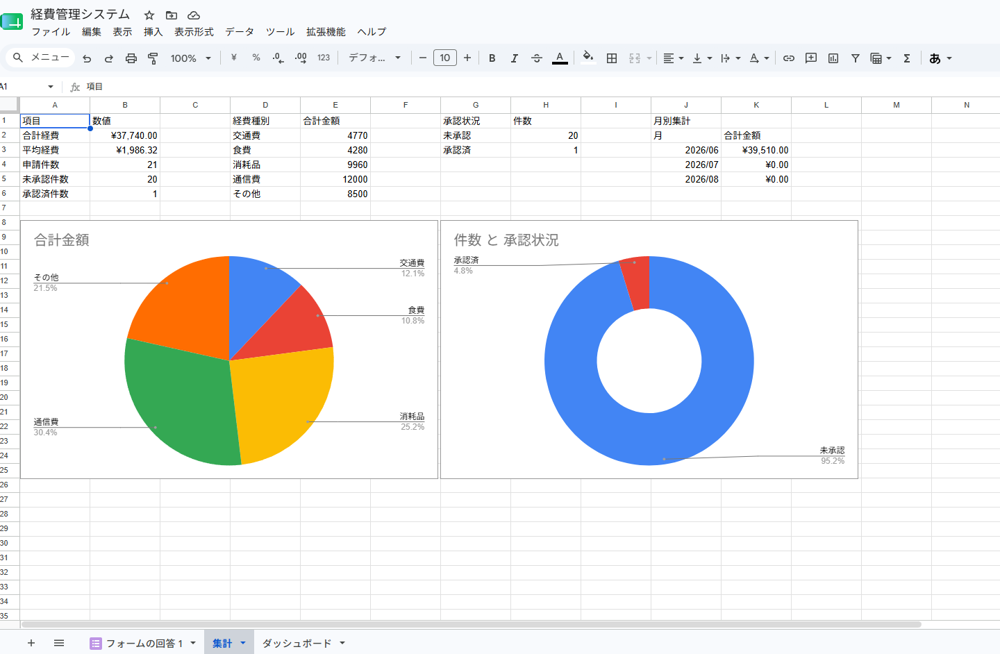

# 経費管理システム

Googleフォーム・Googleスプレッドシート・Google Apps Script（GAS）を使用して作成した経費管理システムです。

## 概要

フォームから申請された経費情報を自動で管理し、承認フローや通知機能を実装した学習用ポートフォリオです。

## 主な機能

- Googleフォームによる経費申請
- スプレッドシートへの自動記録
- 経費番号の自動採番
- 承認状況管理
- 承認メール通知
- 月別集計レポート
- メール送信状況管理

## 使用技術

- Googleフォーム
- Googleスプレッドシート
- Google Apps Script（GAS）
- Gmail

## 画面イメージ

### 経費申請フォーム

### 承認管理画面

### メール通知

### 月別集計レポート

## 工夫した点

- 経費番号を自動採番
- 承認状況を一覧管理
- 承認時に自動メール送信
- 二重送信防止機能
- 月別の経費集計を自動化

## 作成目的

実務でよく利用される経費申請〜承認フローを学習するために作成しました。

## 今後の改善案

- Slack通知連携
- PDF出力
- 部署別集計
- ダッシュボード機能強化
- 承認者権限管理
